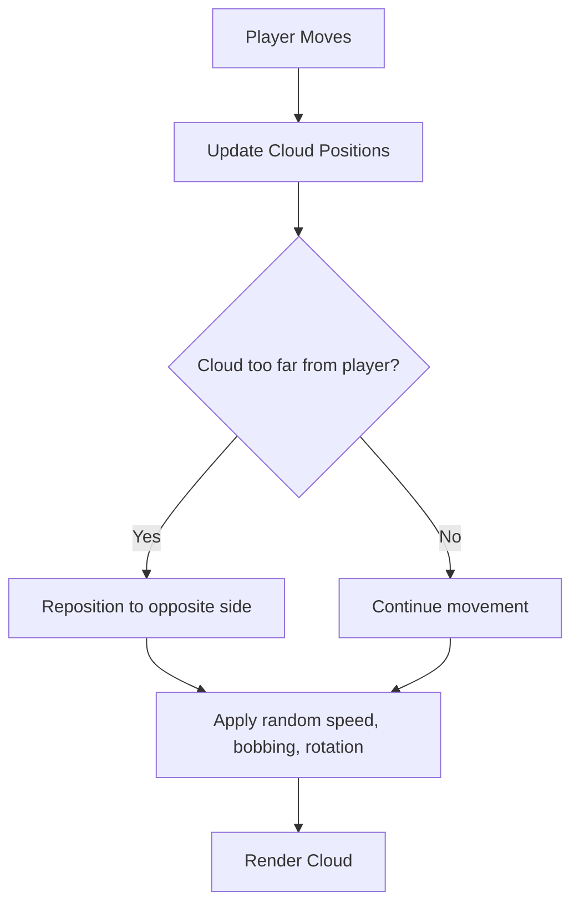

# Enhanced Cloud Swarm Plan

## 1. Increase Cloud Density and Spread
- **cloudCount**: Raise the number of clouds (e.g., from 100 to 200+).
- **cloudSpread**: Increase the area over which clouds are distributed, so the sky feels more alive and continuous as the player moves.

## 2. Add Dynamic Cloud Movement
- **Speed Variation**: Assign each cloud a random horizontal speed and direction, so clouds drift at different rates.
- **Vertical Bobbing**: Enhance the existing vertical movement for more natural, floating behavior.
- **Rotation**: Add subtle rotation to each cloud for visual interest.

## 3. Infinite Wrapping
- When a cloud moves too far from the player, reposition it to the opposite side of the play area, maintaining the illusion of an endless sky.

## 4. Parameter Exposure
- Expose `cloudCount`, `cloudSpread`, and movement parameters for easy tuning (possibly via a debug UI or config).

## 5. Performance Considerations
- Use sprite-based clouds for efficiency.
- Optionally, implement LOD: reduce cloud count or detail at lower graphics settings.

## 6. Optional: Cloud Types/Textures
- Add support for multiple cloud textures or types for more variety.

---

## Mermaid Diagram: Cloud Swarm Update Flow

---

**Summary:**  
This plan will make the sky feel much more dynamic and alive, with clouds constantly drifting, bobbing, and wrapping around the player, all while supporting infinite world traversal.