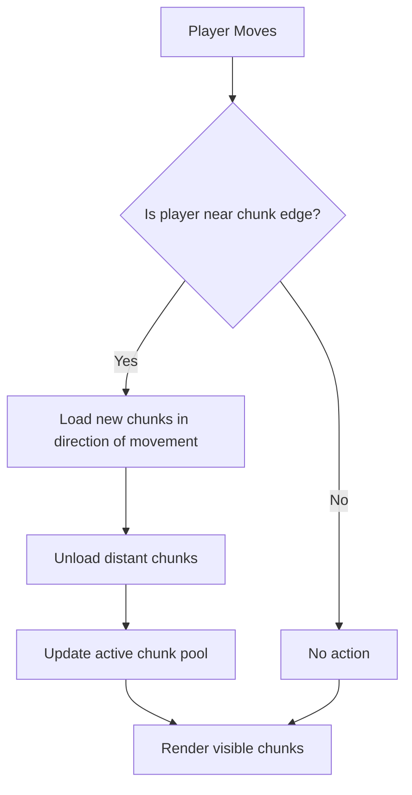

# Infinite World Architecture Plan

## 1. Requirements & Challenges

- **No hard world boundaries:** The player can travel in any direction indefinitely.
- **Procedural generation:** Terrain, biomes, and features are generated on-the-fly using deterministic algorithms (noise, seeds).
- **Chunk streaming:** Only chunks near the player are loaded in memory; distant chunks are unloaded.
- **Performance:** Maintain current performance by limiting active chunks and using LOD (Level of Detail).
- **Persistence (optional):** If the world can be modified, changes must be saved and reloaded as the player revisits areas.
- **Minimap/Navigation:** The minimap must adapt to an infinite world, possibly showing only local surroundings.

---

## 2. High-Level Architecture

### A. Chunk Management

- **Dynamic chunk loading/unloading:**  
  - As the player moves, generate and load new chunks in the direction of travel.
  - Unload chunks that are far outside the player's view distance.
- **Chunk coordinates:**  
  - Use integer chunk coordinates (e.g., (chunkX, chunkZ)) to index and generate chunks anywhere in the world.
- **Procedural determinism:**  
  - Use a global seed so the same chunk coordinates always generate the same terrain/features.

### B. Memory & Performance

- **Active chunk pool:**  
  - Limit the number of loaded chunks to those within a certain radius of the player.
- **LOD (Level of Detail):**  
  - Use lower-detail meshes/textures for distant chunks.
- **Garbage collection:**  
  - Periodically remove unused chunks from memory.

### C. Minimap/Navigation

- **Local minimap:**  
  - Show only the area around the player, not the entire world.
- **World map (optional):**  
  - Allow the player to "discover" and record explored areas, but do not precompute the whole map.

---

## 3. Refactoring Steps

1. **Remove hardcoded world boundaries:**  
   - Eliminate checks like `if (Math.abs(x) > halfSize)` in player and system logic.
2. **Generalize chunk management:**  
   - Ensure chunk generation, loading, and unloading work for any integer chunk coordinate.
3. **Dynamic chunk streaming:**  
   - Implement logic to load new chunks as the player moves and unload distant ones.
4. **Update minimap:**  
   - Refactor minimap to show only local area, or implement a "fog of war" for discovered regions.
5. **(Optional) Persistence:**  
   - If the world is editable, implement a system to save/load changes to disk or server.

---

## 4. Mermaid Diagram: Infinite World Streaming

---

## 5. Summary

- The world becomes truly infinite by removing boundaries and streaming chunks on demand.
- Only a small area around the player is ever loaded, keeping memory and performance in check.
- The minimap and navigation systems must adapt to the infinite world.
- This approach is used in games like Minecraft, No Man's Sky, and others.

---

**Next Steps:**  
- Review and approve this plan, or suggest changes.
- Once approved, proceed to detailed implementation planning and code refactoring.